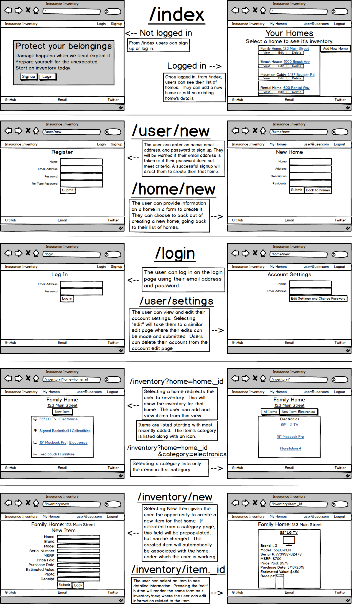

# WDI Project 2 - Insurance Inventory

Project Link: [Insurance Inventory](https://insurance-inventory.herokuapp.com/)

Trello Board: [Trello Board](https://trello.com/b/pWai6NAK/wdi-project-2)

## Finished Product:

## Overview

This is what I developed for the second project in General Assembly's Web Development Immersive.  We had to create a web app using the MEN stack and at least two models created with Mongoose.  I chose to create an insurance inventory app.  This involved three mongoose models (user, home, and item).

## Technologies Used

* **Languages:** HTML5, CSS3, JavaScript
* **MEN Stack:** MongoDB, ExpressJS, and NodeJS
* **CSS:** Flexbox for layout and item order.
* **ODM:** Mongoose
* **Security:** PassportJS, bcrypt-nodejs
* **Mockups:** Balsamiq
* **Project Planning & User Stories:** - Trello
* **Text Editor:** - Sublime Text 3

## Features

* When not logged in, the user sees a login and signup button and a landing div on arrival.  When logged in, their list of homes is rendered and the signup and login buttons are replaced with their email address and a logout button.
* Users can create accounts, create homes, and add items to that home's inventory.
* Users can edit or delete their homes and items.
* Invalid inputs during signup and login, such as incorrect passwords or passwords that don't meet requirements, result in flash messages being displayed.
* User passwords are encrypted, with salts added for increased security.

## Build Process

### Mockups and Features

I created a mockup based around the basic features that I hoped to implement in this project.

Wrapping my head around routing was difficult during the planning phase, with so many routes to consider. I tried to map these routes out in connection with the relevant views. With so much functionality to consider and implement, I decided to focus on implementing that functionality versus creating a responsive product.  While I realize that responsive design is ciritical in today's world, I feel that focusing on and reinforcing the concepts of creating a CRUD app was the best approach for me.

#### Insurance Inventory Mockup

---

### Production Issues:

The biggest hangup for me came with creating a seeds.js file to populate my database.  I wrote this file before writing routes to make sure there weren't any issue with my database and models.  What I ended up with was a seeds.js file that would create and save user documents in the database, create and embed homes in that user document, display that user with their embedded homes in console.log messages, but then fail to save the updated user document.  This resulted in homes never actually being saved to the user.  I sought help from an instructor who helped me work through some code issues, but couldn't figure out this issue.  This was on a Friday night. I decided to spend the weekend working on some design and revisit the issue the next week.

Revisiting the issue with my instructor on Monday, we realized the problem.  We believe we discovered a bug with Mongoose, where changes to embedded arrays of newly created documents are not tracked and therefore not saved.  The changes are saved, however, when made to a re-fetched object.  The solution is to either re-fetch the object or use `.markmodified()` to make Mongoose aware of the changes.  This experience has shown me that sometimes technologies can fail to work as expected, or even as intended.

**You can see the issue in GitHub [here](https://github.com/Automattic/mongoose/issues/4449).**

My other hang-up came with ObjectID referencing and Mongoose's `.populate()` method.  I had a hard time figuring out how to use the method to serve my purposes, even with research and reading documentation.  I finally decided to have a third level of embedding, embedding the inventory within the home within the user.  This actually worked fairly well, and I feel I learned a lot more about how to work with embedded documents in MongoDB.

---

## Future Development

There are many things I'd love to change, modify, or add to this project.

* Tweak the layout to some anchor tags to make the more obvious. In watching classmates interact with the app I realized that links to the home detail views and inventory views aren't very intuitive.
* Clean up routing. It might be cleaner to have 'home' and 'item' routes.  Right now these are a part of the 'users' or 'inventory' routes. (i.e. `router.get('/:homeid/item/:itemid/edit'` in inventory.js)
* Create a selector with pre-set categories for items, along with the ability to filter a home's inventory by item category.
* Calculate the estimated value of a home's inventory.  This would help users determine the approximate level of insurance converage they need.
* Implement responsive design.
* Implement image uploading for images of the home, the item, and a receipt for that item.
* Create a way to serve the user a clean, organized PDF of a home's inventory.
